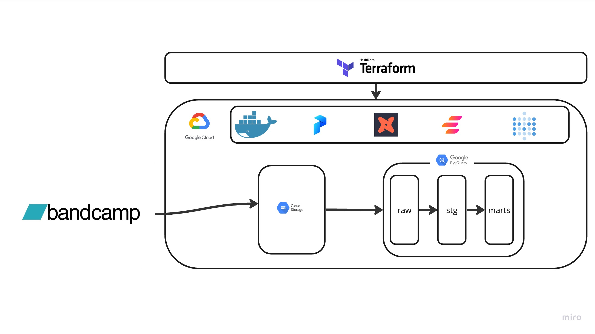
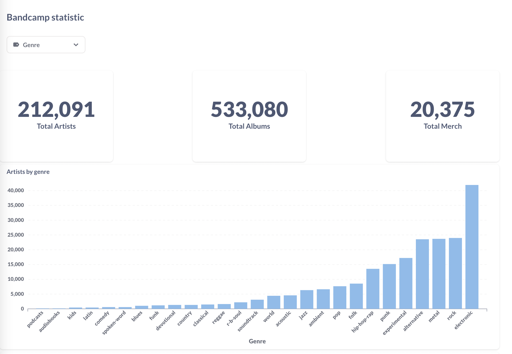

# Bandcamp genre statistic (Datatalks DE Zoomcamp 2023)

The Bandcamp resource data analysis project focuses on collecting data from the Bandcamp platform and performing an analysis of musical genres. The project involves data engineering techniques such as data cleaning, data integration, and data transformation. The data collected will be used to gain insights into the popularity of different music genres on the Bandcamp platform. The analysis will include the classification of music genres, identification of popular genres, and trends. The ultimate goal of the project is to provide valuable insights to music enthusiasts and industry professionals.

# Architecture
Architecture of project consist of next elements:
| Arch element | Description |
| - | - |
| [Google Cloud Platform](https://cloud.google.com/) |  Main element allows store data, compute data etc |
| [Tarraform](https://www.terraform.io/) | Tool to manage GCP and other cloud plaform resourses via code |
| [Prefect](https://www.prefect.io/) | Data flow orchestrator |
| [DBT](https://www.getdbt.com/) | Data tranformation tool |
| [Elementary](https://www.elementary-data.com/) | Observability tool |
| [Metabase](https://www.metabase.com/) | BI Tool |

## Schema

## IAAS Terraform
Project developed on GCP infrastructure that managed by Terraform
To reproduce steps of creating infrastructure follow this [documentation](/docs/terraform.md)

## Project Solution
Solution is packed to docker containers to install it follow this [documentation]
[Dbt-Docs](http://34.65.65.19:8080/)
[Elementary-data](http://34.65.65.19:8081/#/report/dashboard)

# Dashboard

Final dashboard shows bandcamp statictic in musical genres scope:
- Total artists
- Total albums
- Total artist merch
- Barchart with total artists by genre
- Barchart with mean song duration by genre
- Barchart with total merch by genre

Click [here](http://34.65.65.19:3000/public/dashboard/75bc9e51-ef8b-472a-a954-087eb8317956) to view bandcamp statistic dashboard
